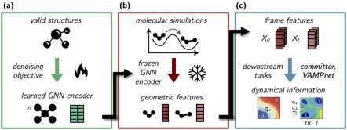

# Geom2vec



Geom2Vec (Geometry-to-vector) is a framework for compute vector representation of molecular conformations using 
pretrained graph neural networks (GNNs). The resulting vectors can be used for dimensionality reduction, committer
function estimation, and in principle any other learnable task for dynamic analysis of molecular simulations.
By avoiding the need to retrain the GNNs for each new simulation analysis pipeline, 
the framework allows for efficient exploration of the dynamics data, which is usually vast in both system size 
and timescale. Comparing to other current or possible (not-yet appearing) graph-based methods, Geom2Vec guarantees 
orders of magnitude advantage in terms of computational efficiency and scalability in both time and memory.

## Installation
The package is based on PyTorch and PyTorch Geometric. 
Follow the instructions on 
the [PyTorch Geometric website](https://pytorch-geometric.readthedocs.io/en/latest/notes/installation.html) 
to install the relevant packages.

Clone the repository and install the package using pip:
```bash
pip install -e .
```
## Package structure
The package is organized as follows:
- `geom2vec` contains the main classes and functions for the framework.
- `checkpoints` contains the pretrained GNNs with different architectures.
- `tutorial` contains basic tutorials for using the package.

Under `geom2vec`:
- `geom2vec.data` contains the data-relevant class and processing utils.
- `geom2vec.downstream_models` contains models for downstream tasks, e.g., committer function estimation.
- `geom2vec.layers` contains building blocks (MLPs and Token mixing layers) for the general network architecture.
Instead, users should directly use the `geom2vec.downstream_models.lobe.lobe` class for best performance and convenience.
- `geom2vec.pretrain` contains dataset classes and training scripts for pretraining the GNNs 
in case users want to train their own models.
- `geom2vec.representation_models` contains the main classes various GNN architectures 
that can be used for representation learning. Currently, we support [TorchMD-ET](https://github.com/torchmd/torchmd-net), 
[ViSNet](https://pytorch-geometric.readthedocs.io/en/latest/generated/torch_geometric.nn.models.ViSNet.html), [TensorNet](https://github.com/torchmd/torchmd-net).

## Usage

Define the representation model and load the pretrained weights:
```python
from geom2vec.infer import create_model

rep_model = create_model(
    model_type = 'tn',
    checkpoint_path = './checkpoints/tensornet_l3_h128_rbf32_r5.pth',
    cutoff = 5,
    hidden_channels = 128,
    num_layers = 3,
    num_rbf = 32,
    device = 'cuda'
)
```
Use the model to compute the vector representations of molecular conformations:
```python
import os
from geom2vec.utils import extract_mda_info_folder
from geom2vec.infer import infer_traj


topology_file = "your_path_to_top_file"
trajectory_folder = "your_path_to_traj_files" 

# you should carefully check the output to make sure the selection is correct
# remember to keep the file list in the same order as the trajectory files (dcd_files)
position_list, atomic_numbers, segment_counts, dcd_files = extract_mda_info_folder(
    folder = trajectory_folder,
    top_file = topology_file,
    stride = 10, # stride of the trajectory
    selection = 'prop mass > 1.1', # by default, we only consider heavy atoms, you can change this as normal MDA selection
)

folder_path = 'your_path_to_save_vector_representations'
if not os.path.exists(folder_path):
    os.makedirs(folder_path)

# infer the trajectory
infer_traj(
    model = rep_model,
    hidden_channels = 128,
    batch_size = 100,
    data = position_list,
    atomic_numbers = atomic_numbers,
    # mapping of the coarse-grained beads, if None, you will get one vector for each frame
    # (frames, beads, 4, hidden_channels) or (frames, 4, hidden_channels)
    cg_mapping = segment_counts, 
    saving_path = folder_path,
    device = 'cuda:0',
    torch_or_numpy = 'torch',
)
```
Once finished, users can refer to `from geom2vec.downstream_models.vamp.vampnet.VAMPNet` for dimensionality reduction, and
`geom2vec.downstream_models.committor.vcn.VarComm` for committer function estimation. We provide tutorials for these tasks
in the `tutorial` folder. From `geom2vec.downstream_models.lobe.lobe`, users can find the general model architecture 
for all downstream tasks.

The `lobe` class can be defined as follows:
```python
import torch
from geom2vec.downstream_models.lobe import lobe

device = torch.device('cuda' if torch.cuda.is_available() else 'cpu')

# Define a simple MLP model without token mixing layers
net = lobe(
    hidden_channels=128, # this should be the same as the hidden_channels in the representation model
    intermediate_channels=128,
    output_channels=2, 
    num_layers=3, # number of layers in the output MLP
    batch_norm=False,
    vector_feature=True, # Whether to use the vector representation or just the scalar part
    mlp_dropout=0.1,
    mlp_out_activation=None, # activation function for the output layer, can be torch.nn.Sigmoid or torch.nn.Softmax, etc.
).to(device)

# Define a model with token mixing layers (SubFormer, Transformer on CG tokens)
net = lobe(
    hidden_channels=128,
    intermediate_channels=128,
    output_channels=2,
    num_layers=3,
    batch_norm=False,
    vector_feature=True,
    mlp_dropout=0.1,
    mlp_out_activation=None,
    token_mixer = 'subformer',
    num_mixer_layers = 4,
    expansion_factor = 2, # expansion factor for the feedforward layer in the Transformer
    pooling = 'cls',
    dropout = 0.2,
)
# Define a model with token mixing layers (SubMixer, MLP-Mixer on CG tokens)
net = lobe(
    hidden_channels=128,
    intermediate_channels=128,
    output_channels=2,
    num_layers=3,
    batch_norm=False,
    vector_feature=True,
    mlp_dropout=0.1,
    mlp_out_activation=None,
    token_mixer = 'submixer',
    num_mixer_layers = 4,
    pooling = 'mean',
    dropout = 0.3,
    num_tokens = 10,
    token_dim = 24
)
```

## Development and Contact
We are currently are active developing the package. If you have any questions or suggestions, please feel free to
open an issue or contact us directly.

## Citation
If you use this package in your research, please cite the following paper:
```
```

## TODO:

- Add [Subspace Iteration](https://github.com/dinner-group/inexact-subspace-iteration) to the downstream models for 
committor function estimation and MFPT calculation.


