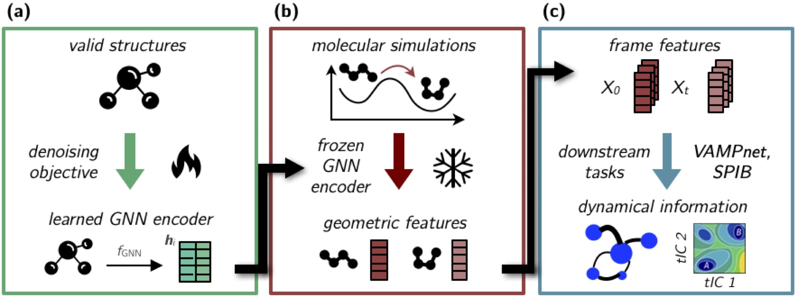
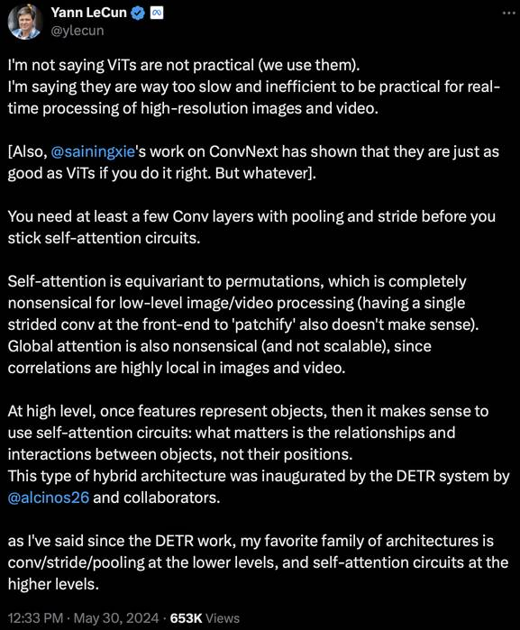

# geom2vec


</img>

geom2vec (geometry-to-vector) is a framework for compute vector representation of molecular conformations using
pretrained graph neural networks (GNNs).

geom2vec offers several attractive features and use cases:

- The vectors representations can be used for dimensionality reduction, committor function estimation, and in principle any other learnable task in analysis of molecular dynamics (MD) simulations.
- By avoiding the need to retrain the GNNs for each new simulation analysis pipeline, the framework allows for efficient exploration of the MD data.
- Compared to other graph-based methods, geom2vec provides orders of magnitude advantage in terms of computational efficiency and scalability in both time and memory.

## Contents

- [Installation](#installation)
- [Repository structure](#repository-structure)
- [Downstream models](#downstream-models)
- [Usage](#usage)
- [Development](#development-and-contact)
- [Citation](#citations)
- [To-do](#to-do)

## Installation

The package is based on PyTorch and PyTorch Geometric. 
Follow the instructions on 
the [PyTorch Geometric website](https://pytorch-geometric.readthedocs.io/en/latest/notes/installation.html)
to install the relevant packages.

Clone the repository and install the package using pip:

```bash
git clone https://github.com/zpengmei/geom2vec.git
cd geom2vec/
pip install -e .
```

## Repository structure

The repository is organized as follows:

- `geom2vec` contains the main classes and functions for the framework.
- `checkpoints` contains the pretrained GNN parameters for different architectures.
- `examples` contains basic tutorials for using the package.

Under `geom2vec`:

- `geom2vec.data` contains the data-relevant class and processing utils.
- `geom2vec.downstream_models` contains models for downstream tasks, e.g., SPIB or VAMPnets.
- `geom2vec.layers` contains building blocks (MLPs and Token mixing layers) for the general network architecture.
Instead, users should directly use the `geom2vec.downstream_models.lobe.Lobe` class for best performance and convenience.
- `geom2vec.pretrain` contains dataset classes and training scripts for pretraining the GNNs 
in case users want to train their own models.
- `geom2vec.representation_models` contains the main classes various GNN architectures 
that can be used for representation learning. Currently, we support [TorchMD-ET](https://github.com/torchmd/torchmd-net), 
[ViSNet](https://pytorch-geometric.readthedocs.io/en/latest/generated/torch_geometric.nn.models.ViSNet.html), [TensorNet](https://github.com/torchmd/torchmd-net).

For convenience, we put common functionalities as follows:
- `geom2vec.create_model` is a wrapper function to load the pretrained GNN models.
- `geom2vec.Lobe` is a general class for downstream tasks, which can be used to define the downstream models.

## Downstream models

We support several dynamics models.
- `geom2vec.downstream_models.VAMPNet` is a class for dimensionality reduction using VAMPNet.
- `geom2vec.downstream_models.StopVAMPNet` is a class for dimensionality reduction using VAMPNet with boundary conditions.
- `geom2vec.downstream_models.SPIB` is a class for constructing MSMs using SPIB
- `geom2vec.downstream_models.VCN` is a class for variational committor function estimation.

## Usage

1. Define the representation model and load the pretrained weights:

```python
from geom2vec import create_model

rep_model = create_model(
    model_type = 'tn',
    checkpoint_path = './checkpoints/tensornet_l3_h128_rbf32_r5.pth',
    cutoff = 5,
    hidden_channels = 128,
    num_layers = 3,
    num_rbf = 32,
    device = 'cuda'
)
```

2. Use the model to compute the vector representations of molecular conformations (we use [MDAnalysis](https://www.mdanalysis.org/) to load and process the trajectories):

```python
import os
from geom2vec.data import extract_mda_info_folder
from geom2vec.data import infer_traj


topology_file = "your_path_to_top_file"
trajectory_folder = "your_path_to_traj_files" 

position_list, atomic_numbers, segment_counts, dcd_files = extract_mda_info_folder(
    folder = trajectory_folder,
    top_file = topology_file,
    stride = 10,
    selection = 'prop mass > 1.1',
)

folder_path = 'your_path_to_save_vector_representations'
if not os.path.exists(folder_path):
    os.makedirs(folder_path)

# infer the trajectory
infer_traj(
    model = rep_model,
    hidden_channels = 128,
    batch_size = 100,
    data = position_list,
    atomic_numbers = atomic_numbers,
    cg_mapping = segment_counts, 
    saving_path = folder_path,
    torch_or_numpy = 'torch',
)
```

3. Once finished, users can refer to `geom2vec.downstream_models` for downstream tasks. We provide tutorials for these tasks
in the `examples` folder. From `geom2vec.Lobe`, users can find the general model architecture
for all downstream tasks.
The `Lobe` class can be defined as follows:

```python
import torch
from geom2vec import Lobe

device = torch.device('cuda' if torch.cuda.is_available() else 'cpu')

# Define a simple MLP model without token mixing layers
# input shape: (batch_size, 4, hidden_channels) 4 refers to the scalar and vector parts of the representation
# output shape: (batch_size, output_channels)

mlp = Lobe(
    hidden_channels=128,
    intermediate_channels=128,
    output_channels=2, 
    num_layers=3,
    batch_norm=False,
    vector_feature=True, # Whether to use the vector representation or just the scalar part
    mlp_dropout=0.1,
    mlp_out_activation=None,
    device=device,
)

# Define a model with token mixing layers (SubFormer, Transformer on CG tokens)
# input shape: (batch_size, num_tokens, 4, hidden_channels)
# output shape: (batch_size, output_channels)

subformer = Lobe(
    hidden_channels=128,
    intermediate_channels=128,
    output_channels=2,
    num_layers=3,
    batch_norm=False,
    vector_feature=True,
    mlp_dropout=0.1,
    mlp_out_activation=None,
    token_mixer = 'subformer',
    num_mixer_layers = 4,
    expansion_factor = 2,
    pooling = 'cls',
    dropout = 0.2,
    device=device,
)

# Define a model with token mixing layers (SubMixer, MLP-Mixer on CG tokens)
# input shape: (batch_size, num_tokens, 4, hidden_channels)
# output shape: (batch_size, output_channels)

submixer = Lobe(
    hidden_channels=128,
    intermediate_channels=128,
    output_channels=2,
    num_layers=3,
    batch_norm=False,
    vector_feature=True,
    mlp_dropout=0.1,
    mlp_out_activation=None,
    token_mixer = 'submixer',
    num_mixer_layers = 4,
    expansion_factor = 2,
    pooling = 'mean',
    dropout = 0.3,
    num_tokens = 10,
    token_dim = 24,
    device=device,
)
```

## Development and contact

We are currently are active developing the package. If you have any questions or suggestions, please feel free to
open an issue or contact us directly.

## Citations

If you use this package in your research, please cite the following papers:
```bibtex
@misc{pengmei2024geom2vecpretrainedgnnsgeometric,
    title={geom2vec: pretrained GNNs as geometric featurizers for conformational dynamics}, 
    author={Zihan Pengmei and Chatipat Lorpaiboon and Spencer C. Guo and Jonathan Weare and Aaron R. Dinner},
    year={2024},
    eprint={2409.19838},
    archivePrefix={arXiv},
    primaryClass={cs.LG},
    url={https://arxiv.org/abs/2409.19838}, 
}
@misc{pengmei2024pushinglimitsallatomgeometric,
      title={Pushing the Limits of All-Atom Geometric Graph Neural Networks: Pre-Training, Scaling and Zero-Shot Transfer}, 
      author={Zihan Pengmei and Zhengyuan Shen and Zichen Wang and Marcus Collins and Huzefa Rangwala},
      year={2024},
      eprint={2410.21683},
      archivePrefix={arXiv},
      primaryClass={cs.LG},
      url={https://arxiv.org/abs/2410.21683}, 
}
@misc{pengmei2023transformers,
    title={Transformers are efficient hierarchical chemical graph learners}, 
    author={Zihan Pengmei and Zimu Li and Chih-chan Tien and Risi Kondor and Aaron R. Dinner},
    year={2023},
    eprint={2310.01704},
    archivePrefix={arXiv},
    primaryClass={cs.LG}
}
@misc{pengmei2024technical,
    title={Technical Report: The Graph Spectral Token -- Enhancing Graph Transformers with Spectral Information}, 
    author={Zihan Pengmei and Zimu Li},
    year={2024},
    eprint={2404.05604},
    archivePrefix={arXiv},
    primaryClass={cs.LG}
}
```

Please consider citing the following papers for each of the downstream tasks:
```bibtex
@article{mardt2018vampnets,
    title = {{VAMPnets} for deep learning of molecular kinetics},
    volume = {9},
    issn = {2041-1723},
    url = {http://www.nature.com/articles/s41467-017-02388-1},
    doi = {10.1038/s41467-017-02388-1},
    language = {en},
    number = {1},
    urldate = {2020-06-18},
    journal = {Nature Communications},
    author = {Mardt, Andreas and Pasquali, Luca and Wu, Hao and Noé, Frank},
    month = jan,
    year = {2018},
    pages = {5},
}
@article{chen_discovering_2023,
    title = {Discovering {Reaction} {Pathways}, {Slow} {Variables}, and {Committor} {Probabilities} with {Machine} {Learning}},
    volume = {19},
    issn = {1549-9618},
    url = {https://doi.org/10.1021/acs.jctc.3c00028},
    doi = {10.1021/acs.jctc.3c00028},
    number = {14},
    urldate = {2024-04-30},
    journal = {Journal of Chemical Theory and Computation},
    author = {Chen, Haochuan and Roux, Benoît and Chipot, Christophe},
    month = jul,
    year = {2023},
    pages = {4414--4426},
}
@misc{wang2024informationbottleneckapproachmarkov,
    title={An Information Bottleneck Approach for Markov Model Construction}, 
    author={Dedi Wang and Yunrui Qiu and Eric Beyerle and Xuhui Huang and Pratyush Tiwary},
    year={2024},
    eprint={2404.02856},
    archivePrefix={arXiv},
    primaryClass={physics.bio-ph},
    url={https://arxiv.org/abs/2404.02856}, 
}
@article{wang2021state,
	title = {State predictive information bottleneck},
	volume = {154},
	issn = {0021-9606},
	url = {http://aip.scitation.org/doi/10.1063/5.0038198},
	doi = {10.1063/5.0038198},
	number = {13},
	urldate = {2021-09-18},
	journal = {The Journal of Chemical Physics},
	author = {Wang, Dedi and Tiwary, Pratyush},
	month = apr,
	year = {2021},
	pages = {134111},
}
```

## To-do

- [ ] Add [subspace iteration](https://github.com/dinner-group/inexact-subspace-iteration) to the downstream models for 
committor function estimation and MFPT calculation.

## Why mix tokens?
We share the same opinion as shown below:


