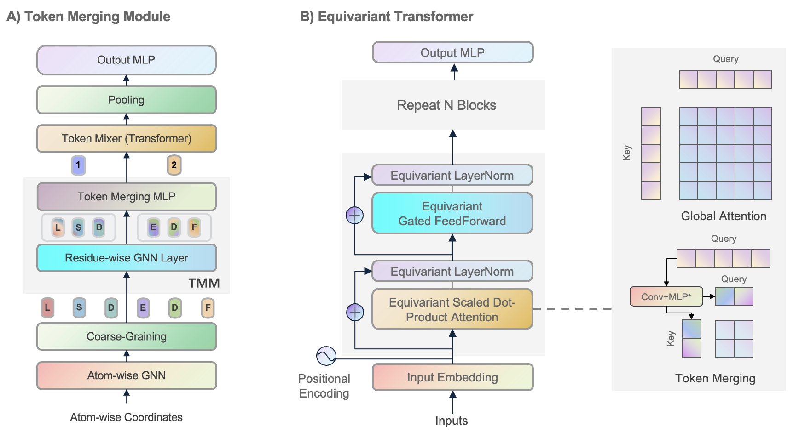
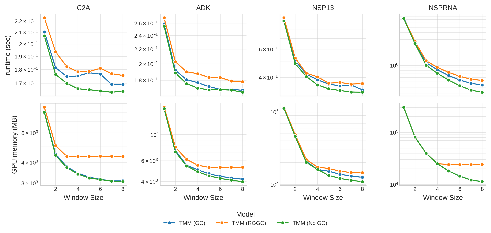
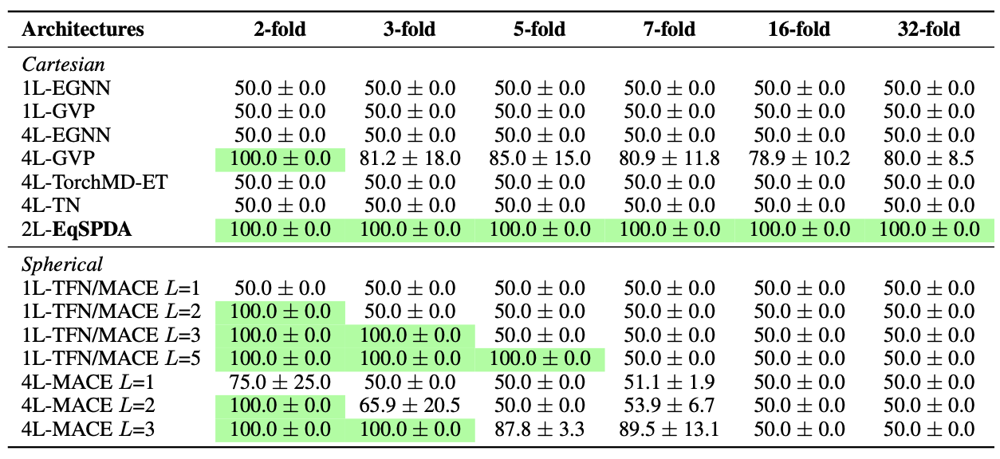
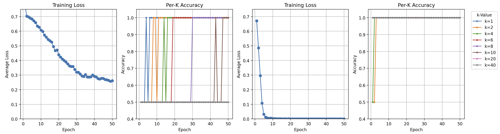

# geom2vec


geom2vec (geometry-to-vector) is a framework for compute vector representation of molecular conformations using
pretrained graph neural networks (GNNs).

geom2vec offers several attractive features and use cases:

- The vectors representations can be used for dimensionality reduction, committor function estimation, and in principle any other learnable task in analysis of molecular dynamics (MD) simulations.
- By avoiding the need to retrain the GNNs for each new simulation analysis pipeline, the framework allows for efficient exploration of the MD data.
- Compared to other graph-based methods, geom2vec provides orders of magnitude advantage in terms of computational efficiency and scalability in both time and memory.

## Contents

- [Installation](#installation)
- [Repository structure](#repository-structure)
- [New Features](#new-features)
- [Pretrained Checkpoints](#pretrained-checkpoints)
- [Downstream models](#downstream-models)
- [Usage](#usage)
- [Example Notebooks](#example-notebooks)
- [Development](#development-and-contact)
- [Citations](#citations)

## Installation

The package is based on PyTorch and PyTorch Geometric. 
Follow the instructions on 
the [PyTorch Geometric website](https://pytorch-geometric.readthedocs.io/en/latest/notes/installation.html)
to install the relevant packages.

Clone the repository and install the package using pip:

```bash
git clone https://github.com/zpengmei/geom2vec.git
cd geom2vec/
pip install -e .
# Optional: install training dependencies (PyTorch + PyG stack, optimizers, etc.)
pip install -e .[torch,pyg,optim]
```

## Repository structure

The repository is organized as follows:

- `src/geom2vec` contains the runtime package exposed on install.
- `checkpoints` contains the pretrained GNN parameters for different architectures.
- `examples` contains basic tutorials for using the package.

Under `src/geom2vec`:

- `geom2vec.data` contains data I/O helpers, preprocessing utilities, and feature packing logic.
- `geom2vec.models.representation` bundles pretrained GNN architectures (TorchMD-ET, ViSNet, TensorNet).
- `geom2vec.models.downstream` provides downstream heads (Lobe variants) and task-specific models (VAMPNet, SPIB).
- `geom2vec.nn` contains reusable neural network layers and mixers.
- `geom2vec.train` contains dataset classes and CLI scripts for pretraining the GNNs 
in case users want to train their own models.

For convenience, we put common functionalities as follows:
- `geom2vec.create_model` is a wrapper function to load the pretrained GNN models with manual configuration.
- `geom2vec.create_model_from_checkpoint` automatically infers model hyperparameters from checkpoint filenames.
- `geom2vec.Lobe` is a general class for downstream tasks, which can be used to define downstream models end-to-end.

## New Features



### Token Merging Module (TMM)

The `Lobe` downstream head now includes an optional **token merging** mechanism that downsamples tokens before applying the mixer. This is useful for systems with many tokens (e.g., large proteins with many residues) where full attention is computationally expensive.



- **`ScalarMerger`**: For standard (non-equivariant) representations, groups tokens into fixed windows and projects concatenated features via an MLP.
- **`EquivariantTokenMerger`**: For equivariant representations, separately merges scalar and vector channels while preserving trans/roto-equivariance.

Enable token merging by setting `merger=True` and specifying `merger_window`:

```python
lobe = Lobe(
    ...,
    merger=True,
    merger_window=4,  # merge every 4 tokens into 1
)
```

### Equivariant Transformer

When `equi_rep=True`, the `Lobe` uses an **Equivariant Self-Attention** mixer instead of a standard transformer. This module processes scalar and vector features while maintaining SE(3) equivariance:

- **Scalar attention**: Standard multi-head self-attention on the scalar channel.
- **Vector attention**: Aggregates vector features using attention weights derived from scalars.
- **Gated vector updates**: Uses invariant features (dot products and norms of vectors) to compute gates that modulate vector updates, ensuring rotation equivariance.
- **Cross-channel interaction**: Scalar outputs are updated using vector invariants (dot products and norms), enabling information flow between scalar and vector representations.

The equivariant attention supports two backends:
- `equi_backend="torch"`: Pure PyTorch implementation (works on CPU and GPU).
- `equi_backend="triton"`: Optimized Triton FlashAttention kernel (requires Triton).


```python
lobe = Lobe(
    ...,
    equi_rep=True,
    equi_backend="triton",  # or "torch"
    nhead=8,
    num_mixer_layers=4,
)
```

### Discriminative Power of Equivariant Transformer

The equivariant transformer demonstrates strong discriminative power in distinguishing subtle geometric differences:

**K-fold Rotation Discrimination**: The global equivariant attention mechanism can effectively differentiate between k-fold rotational symmetries. For each fold, we generate random pairs composed of an original graph and its rotated copy (rotation angle randomly determined and smaller than its intrinsic rotation angle). Results show significantly improved accuracy compared to local message-passing approaches (including spherical harmonic ones).



**K-chain Long-range Interaction**: The transformer architecture enables modeling of long-range interactions across protein chains. The figure below shows training curves and testing accuracies when learning to differentiate the k-chain example using (Left) four layers of TorchMD-ET vs. (Right) two layers of Equivariant Self-Attention (EqSDPA).



## Pretrained Checkpoints

We provide pretrained checkpoints for three GNN architectures in the `checkpoints/` folder:

| Architecture | Checkpoint | Layers | Hidden | RBF | Cutoff (Å) |
|--------------|-----------|--------|--------|-----|------------|
| ViSNet | `visnet_l6_h64_rbf64_r75.pth` | 6 | 64 | 64 | 7.5 |
| ViSNet | `visnet_l6_h128_rbf64_r75.pth` | 6 | 128 | 64 | 7.5 |
| ViSNet | `visnet_l6_h256_rbf64_r75.pth` | 6 | 256 | 64 | 7.5 |
| ViSNet | `visnet_l6_h256_rbf32_r5_pcqm.pth` | 6 | 256 | 32 | 5.0 |
| ViSNet | `visnet_l9_h256_rbf32_r5_pcqm.pth` | 9 | 256 | 32 | 5.0 |
| TorchMD-ET | `et_l6_h64_rbf64_r75.pth` | 6 | 64 | 64 | 7.5 |
| TorchMD-ET | `et_l6_h128_rbf64_r75.pth` | 6 | 128 | 64 | 7.5 |
| TorchMD-ET | `et_l6_h256_rbf64_r75.pth` | 6 | 256 | 64 | 7.5 |
| TensorNet | `tensornet_l2_h200_rbf32_r5.pth` | 2 | 200 | 32 | 5.0 |
| TensorNet | `tensornet_l3_h64_rbf32_r5.pth` | 3 | 64 | 32 | 5.0 |
| TensorNet | `tensornet_l3_h128_rbf32_r5.pth` | 3 | 128 | 32 | 5.0 |
| TensorNet | `tensornet_l3_h256_rbf32_r5.pth` | 3 | 256 | 32 | 5.0 |

## Downstream models

We support several dynamics models:
- `geom2vec.models.downstream.VAMPNet` is a class for dimensionality reduction using VAMPNet.
- `geom2vec.models.downstream.VAMPWorkflow` provides a high-level interface for training VAMPNet on embeddings.
- `geom2vec.models.downstream.BiasedVAMPWorkflow` extends VAMPWorkflow with support for biased MD simulations (reweighting).
- `geom2vec.models.downstream.SPIBModel` implements the State Predictive Information Bottleneck for constructing MSMs.
- `geom2vec.models.downstream.Lobe` is the recommended downstream head for mixing scalar/vector features.
  When `equi_rep=True`, Lobe uses an equivariant transformer (optionally with a FlashAttention Triton kernel) token mixer built from `EquivariantSelfAttention` blocks:
  scalar channels are processed with standard multi-head attention, while vector channels are updated via gated, rotation-equivariant updates based on vector norms and inner products efficiently.

## Usage

### 1. Loading a Pretrained Model

```python
import torch
from geom2vec import create_model_from_checkpoint

checkpoint_path = "checkpoints/visnet_l6_h64_rbf64_r75.pth"
device = "cuda" if torch.cuda.is_available() else "cpu"

# Hyperparameters are automatically inferred from the checkpoint filename
model = create_model_from_checkpoint(checkpoint_path, device=device)
```

### 2. Batch Inference with MDAnalysis

Use `infer_mdanalysis_folder` to extract embeddings from trajectory files:

```python
from pathlib import Path
from geom2vec import create_model_from_checkpoint
from geom2vec.data import infer_mdanalysis_folder

model = create_model_from_checkpoint("checkpoints/visnet_l6_h64_rbf64_r75.pth", device="cuda")

summary = infer_mdanalysis_folder(
    model=model,
    topology_file="topology.pdb",
    trajectory_folder="trajectories/",
    output_dir="embeddings/",
    stride=100,                    # stride for reading frames
    selection="prop mass > 1.1",   # MDAnalysis selection (e.g., heavy atoms)
    batch_size=32,
    reduction="sum",               # how to aggregate atom features
    overwrite=False,               # skip already processed files
)
```

### 3. Training VAMPNet on Embeddings

```python
import torch
from geom2vec.models.downstream import Lobe, VAMPWorkflow
from geom2vec.models.downstream.vamp.vampnet import VAMPNetConfig

# Load precomputed embeddings
embedding_paths = sorted(Path("embeddings/").glob("*.pt"))
trajectories = [torch.load(p) for p in embedding_paths]

hidden_channels = trajectories[0].shape[-1]
num_tokens = trajectories[0].shape[1]

# Build a Lobe head
lobe = Lobe(
    input_channels=hidden_channels,
    hidden_channels=hidden_channels,
    output_channels=3,              # number of CVs
    num_mlp_layers=2,
    num_tokens=num_tokens,
    equi_rep=True,                  # use equivariant attention mixer
    equi_backend="triton",          # or "torch" for CPU
).cuda()

# Configure and run workflow
config = VAMPNetConfig(
    device="cuda",
    learning_rate=1e-4,
    score_method="vamp-2",
)

workflow = VAMPWorkflow(
    lobe=lobe,
    trajectories=trajectories,
    lag_time=1,
    config=config,
    train_fraction=0.8,
    batch_size=1000,
)

vamp = workflow.fit(n_epochs=100)

# Extract collective variables
train_cvs = workflow.get_cvs(split="train")
```

### 4. SPIB for Markov State Model Construction

After training VAMPNet, use SPIB for discrete state discovery:

```python
import numpy as np
from sklearn.cluster import MiniBatchKMeans
from geom2vec.data import Preprocessing
from geom2vec.models.downstream import SPIBModel, Lobe

# Cluster VAMPNet CVs to get initial labels
cvs = workflow.transform(trajectories, instantaneous=True, return_cv=True)
kmeans = MiniBatchKMeans(n_clusters=50, random_state=0)
labels = kmeans.fit_predict(np.concatenate(cvs))

# Split labels per trajectory
labels_per_traj = []
offset = 0
for traj in cvs:
    labels_per_traj.append(labels[offset:offset + len(traj)])
    offset += len(traj)

# Create SPIB datasets
preprocess = Preprocessing(dtype=torch.float32, backend="none")
train_dataset, test_dataset = preprocess.create_spib_train_test_datasets(
    data_list=trajectories,
    label_list=labels_per_traj,
    train_fraction=0.8,
    lag_time=2,
    output_dim=50,
)

# Train SPIB
spib_lobe = Lobe(
    input_channels=hidden_channels,
    hidden_channels=hidden_channels,
    output_channels=128,
    num_mlp_layers=2,
    num_tokens=num_tokens,
    equi_rep=True,
).cuda()

spib = SPIBModel.from_lobe(
    lobe=spib_lobe,
    num_tokens=num_tokens,
    hidden_channels=hidden_channels,
    output_dim=50,
    lag_time=2,
    device="cuda",
)

spib.fit(train_dataset, test_dataset, batch_size=2048, patience=5, refinements=5)
```

### 5. Biased VAMP Workflow (Reweighted Dynamics)

For biased MD simulations (e.g., metadynamics), use `BiasedVAMPWorkflow`:

```python
import numpy as np
from geom2vec.models.downstream.vamp.workflow import BiasedVAMPWorkflow

# Compute log weights from bias potential (e.g., PLUMED COLVAR)
k_b = 0.008314  # kJ mol^-1 K^-1
temperature = 300.0
beta = 1.0 / (k_b * temperature)
log_weights = beta * bias_potential  # from COLVAR file

# Prepare trajectory entries with coordinates for merger
trajectory_entries = [{"graph_features": embeddings, "ca_coords": residue_coords}]

workflow = BiasedVAMPWorkflow(
    lobe=lobe,
    trajectories=trajectory_entries,
    lag_time=1,
    log_weights=[log_weights],
    batch_size=1024,
    train_fraction=0.8,
    config=config,
)

vamp = workflow.fit(n_epochs=150)
```

## Example Notebooks

See the `examples/` folder for complete tutorials:
- `1_infer_mdanalysis.ipynb`: Batch inference using MDAnalysis
- `2_vamp_workflow.ipynb`: VAMPNet training workflow
- `3_vamp_spib_workflow.ipynb`: Combined VAMPNet + SPIB pipeline
- `4_biased_vamp_workflow.ipynb`: Biased VAMP for reweighted dynamics

## Development and contact

We are actively developing the package. If you have any questions or suggestions, please feel free to
open an issue or contact us directly.

## Citations

If you use this package in your research, please cite the following papers:
```bibtex
@misc{pengmei2025hierarchicalgeometricdeeplearning,
      title={Hierarchical geometric deep learning enables scalable analysis of molecular dynamics}, 
      author={Zihan Pengmei and Spencer C. Guo and Chatipat Lorpaiboon and Aaron R. Dinner},
      year={2025},
      eprint={2512.06520},
      archivePrefix={arXiv},
      primaryClass={cs.LG},
      url={https://arxiv.org/abs/2512.06520}, 
}

@article{pengmei2025using,
  title={Using pretrained graph neural networks with token mixers as geometric featurizers for conformational dynamics},
  author={Pengmei, Zihan and Lorpaiboon, Chatipat and Guo, Spencer C and Weare, Jonathan and Dinner, Aaron R},
  journal={The Journal of Chemical Physics},
  volume={162},
  number={4},
  year={2025},
  publisher={AIP Publishing}
}

@inproceedings{pengmei2025pushing,
	title={Pushing the Limits of All-Atom Geometric Graph Neural Networks: Pre-Training, Scaling, and Zero-Shot Transfer},
	author={Zihan Pengmei and Zhengyuan Shen and Zichen Wang and Marcus D. Collins and Huzefa Rangwala},
	booktitle={The Thirteenth International Conference on Learning Representations},
	year={2025},
	url={https://openreview.net/forum?id=4S2L519nIX}
}

@misc{pengmei2023transformers,
    title={Transformers are efficient hierarchical chemical graph learners}, 
    author={Zihan Pengmei and Zimu Li and Chih-chan Tien and Risi Kondor and Aaron R. Dinner},
    year={2023},
    eprint={2310.01704},
    archivePrefix={arXiv},
    primaryClass={cs.LG}
}
```

Please consider citing the following papers for each of the downstream tasks:
```bibtex
@article{mardt2018vampnets,
    title = {{VAMPnets} for deep learning of molecular kinetics},
    volume = {9},
    issn = {2041-1723},
    url = {http://www.nature.com/articles/s41467-017-02388-1},
    doi = {10.1038/s41467-017-02388-1},
    language = {en},
    number = {1},
    urldate = {2020-06-18},
    journal = {Nature Communications},
    author = {Mardt, Andreas and Pasquali, Luca and Wu, Hao and Noé, Frank},
    month = jan,
    year = {2018},
    pages = {5},
}
@article{chen_discovering_2023,
    title = {Discovering {Reaction} {Pathways}, {Slow} {Variables}, and {Committor} {Probabilities} with {Machine} {Learning}},
    volume = {19},
    issn = {1549-9618},
    url = {https://doi.org/10.1021/acs.jctc.3c00028},
    doi = {10.1021/acs.jctc.3c00028},
    number = {14},
    urldate = {2024-04-30},
    journal = {Journal of Chemical Theory and Computation},
    author = {Chen, Haochuan and Roux, Benoît and Chipot, Christophe},
    month = jul,
    year = {2023},
    pages = {4414--4426},
}
@misc{wang2024informationbottleneckapproachmarkov,
    title={An Information Bottleneck Approach for Markov Model Construction}, 
    author={Dedi Wang and Yunrui Qiu and Eric Beyerle and Xuhui Huang and Pratyush Tiwary},
    year={2024},
    eprint={2404.02856},
    archivePrefix={arXiv},
    primaryClass={physics.bio-ph},
    url={https://arxiv.org/abs/2404.02856}, 
}
@article{wang2021state,
	title = {State predictive information bottleneck},
	volume = {154},
	issn = {0021-9606},
	url = {http://aip.scitation.org/doi/10.1063/5.0038198},
	doi = {10.1063/5.0038198},
	number = {13},
	urldate = {2021-09-18},
	journal = {The Journal of Chemical Physics},
	author = {Wang, Dedi and Tiwary, Pratyush},
	month = apr,
	year = {2021},
	pages = {134111},
}
```
